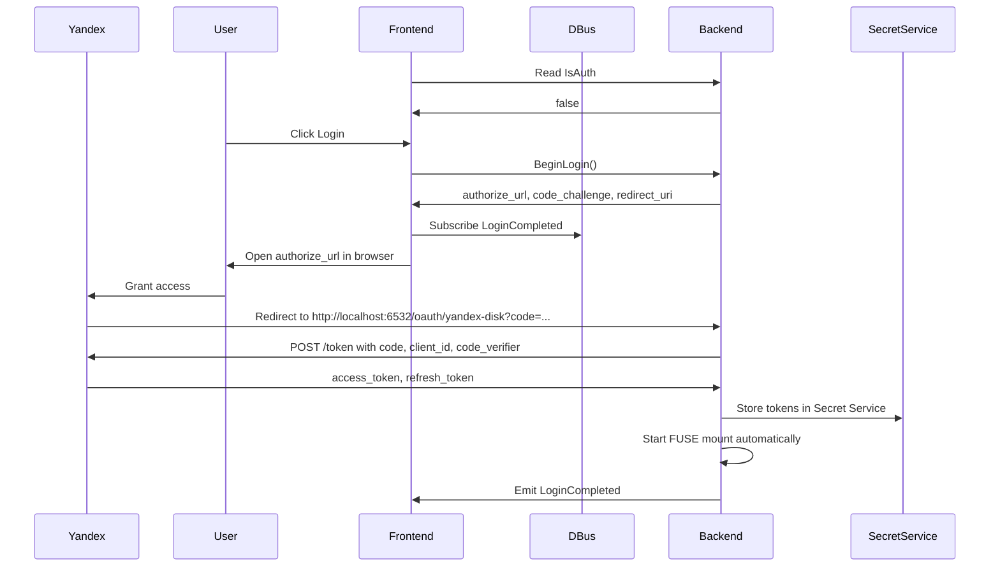

# discohack-daemon

FUSE mount for Yandex Disk with read and write support.

## Requirements

- Linux with FUSE support (`/dev/fuse`)
- A running session D-Bus
- A Secret Service provider in the user session (for example GNOME Keyring or KWallet)
- Rust toolchain

## Configuration

The daemon no longer requires `YANDEX_DISK_TOKEN` in `.env` as the primary auth path.

Authentication is handled at runtime through:
- D-Bus service `ru.literallycats.daemon`
- Yandex OAuth PKCE flow
- localhost callback `http://localhost:6532/oauth/yandex-disk`
- Secret Service storage via the `secret-service` crate

The Yandex OAuth client is configured with redirect URI:

```text
http://localhost:6532/oauth/yandex-disk
```

## Run

```bash
cargo run -- <mountpoint>
```

Example:

```bash
mkdir -p /tmp/yadisk-mnt
cargo run -- /tmp/yadisk-mnt
```

Startup behavior:
- the daemon registers the session-bus name `ru.literallycats.daemon`
- it starts the OAuth callback listener on `http://localhost:6532/oauth/yandex-disk`
- it initializes the local SQLite metadata store and cache directory
- if stored credentials already exist in Secret Service, it can mount immediately
- if cached local state already exists, it can mount from that state even before the network is usable
- otherwise it stays alive with `IsAuth = false` until login completes

After successful login the daemon mounts Yandex Disk automatically. Then inspect and modify the mounted filesystem:

```bash
ls -la /tmp/yadisk-mnt
cat /tmp/yadisk-mnt/some-file.txt
echo hello > /tmp/yadisk-mnt/hello.txt
mkdir -p /tmp/yadisk-mnt/new-dir
mv /tmp/yadisk-mnt/hello.txt /tmp/yadisk-mnt/new-dir/hello.txt
```

Stop the daemon with `Ctrl-C` or `SIGTERM` for a graceful shutdown. The daemon now attempts to unmount the FUSE mount before exiting so the same mountpoint can be reused immediately.

If graceful cleanup fails unexpectedly, recover the mountpoint manually:

```bash
fusermount -u /tmp/yadisk-mnt
```

## Logging

The daemon uses `tracing` for structured lifecycle logs.

- Default log level: `info`
- Override with `RUST_LOG`, for example:

```bash
RUST_LOG=debug cargo run -- /tmp/yadisk-mnt
```

## Offline-First Architecture

The daemon now behaves as a local-first sync client instead of an online-first FUSE bridge.

Core model:
- the mounted filesystem reads metadata from SQLite and file bytes from a managed local cache directory
- local writes complete against the local cache first
- metadata updates and sync-job enqueue happen in SQLite
- a background worker uploads, deletes, creates directories, and moves paths against Yandex Disk later
- the queue survives daemon restart and crash because it lives in SQLite, not RAM

Practical consequences:
- cached files remain readable offline
- local edits remain visible immediately after `write`/`truncate`
- `flush`, `fsync`, and `release` no longer wait for cloud upload to succeed
- reconnecting the network allows the background worker to continue automatically

## Sync State Machine

Primary file sync states are stored as integer enums in SQLite and mirrored in Rust enums:
- `0 = synced`
- `1 = queued_upload`
- `2 = uploading`
- `3 = downloading`
- `4 = conflict`
- `5 = queued_delete`
- `6 = error`
- `7 = placeholder`
- `8 = queued_mkdir`
- `9 = queued_move`

Queue enums:
- `op_type`: `upload`, `delete`, `mkdir`, `move`, `rename`
- `op_status`: `pending`, `leased`, `done`, `retryable_error`, `permanent_error`, `conflict`

The daemon uses centralized `#[repr(i32)]` Rust enums with explicit `TryFrom<i32>` decoding so unknown DB values fail loudly instead of silently degrading.

## SQLite Schema

The daemon manages a local SQLite database with these main tables:

- `files`
  Stores path metadata, sync state, local version counters, remote version token, remote path, cache-file location, and directory hierarchy.
- `operations_queue`
  Stores persistent high-level sync jobs with lease ownership, retry metadata, and timestamps.
- `conflicts`
  Stores conflict records with original path, conflict copy path, and remote-version context.

Important properties of the schema:
- integer enums with `CHECK` constraints
- indices for fast pending-job leasing and path lookups
- non-destructive startup migration using `CREATE TABLE IF NOT EXISTS`
- WAL mode for better durability under concurrent filesystem and worker access

## Local Cache and Read Semantics

Read flow:
- if file bytes already exist locally, reads come from the local cache
- if only metadata exists, the file is treated as a placeholder and the daemon lazily downloads bytes on first read/open when the network is available
- once downloaded, the local cache becomes authoritative for mounted reads until a later sync refresh changes it

Write flow:
- writes go directly into the managed cache file
- file size and version metadata are updated locally
- repeated writes coalesce into one pending upload intent in `operations_queue`

## Queue and Worker Semantics

The queue stores high-level jobs, not every low-level FUSE write event.

Coalescing rules:
- repeated writes to one file collapse into one upload job
- delete supersedes stale upload/move/mkdir jobs for the same entry
- repeated renames update the latest pending move payload instead of appending more queue rows

Worker behavior:
- leases one job at a time from SQLite
- restores expired leases after crash/restart
- retries transient failures later
- marks durable `error` or `conflict` state when work needs attention

## Conflict Policy

The daemon does not do automatic merge and does not use last-write-wins.

Before upload it compares the current remote version token with the last synchronized remote version stored locally.

If the remote version changed:
- the original remote file keeps its original name
- the local offline version is renamed to a conflict copy using a numeric suffix
- a conflict record is stored in SQLite
- the conflict copy is queued as a separate upload

Examples:
- `file.txt` -> `file (2).txt`
- `file (2).txt` -> `file (3).txt`
- `archive.tar.gz` -> `archive.tar (2).gz`

## D-Bus API

The daemon still exposes the same D-Bus object:
- service: `ru.literallycats.daemon`
- object path: `/ru/literallycats/daemon`
- interface: `ru.literallycats.daemon`

Auth control plane stays compatible:
- property `IsAuth`
- method `BeginLogin()`
- signal `LoginCompleted`

New sync-state properties:
- `SyncSummary: a{sv}`
- `SyncItems: aa{sv}`

`SyncSummary` fields:
- `active_count: u`
- `uploading_count: u`
- `downloading_count: u`
- `queued_count: u`
- `conflict_count: u`
- `error_count: u`
- `last_update_unix: x`
- `is_syncing: b`
- `attention_required: b`

`SyncItems` fields per item:
- `path: s`
- `state: s`
- `direction: s`
- `progress: u`
- `bytes_done: t`
- `bytes_total: t`
- `updated_at: x`

Property changes are signaled through standard `org.freedesktop.DBus.Properties.PropertiesChanged` updates.

## Authentication

# Authentication

`BeginLogin()` returns:
- `authorize_url`
- `code_challenge`
- `redirect_uri`

PKCE details:
- the daemon generates a random `code_verifier`
- it computes `code_challenge = BASE64URL_NO_PAD(SHA256(code_verifier))`
- Yandex receives the `code_challenge` during `/authorize`
- the daemon sends the original `code_verifier` to `/token`

High-level flow:



Operational notes:
- the daemon uses Secret Service as the persistent token store
- access tokens are refreshed with the stored refresh token when needed
- the mounted filesystem continues using service-managed credentials instead of `.env`

## Limitations

- uploads are still whole-file uploads, not remote block patches
- first access to a never-downloaded placeholder file still needs network connectivity
- the worker currently reports queue/download activity and attention state, but not byte-accurate upload progress
- the repository still does not contain a GTK app or GNOME Shell extension; clients must consume sync state through D-Bus directly
- `mknod` and several advanced filesystem operations remain unsupported
