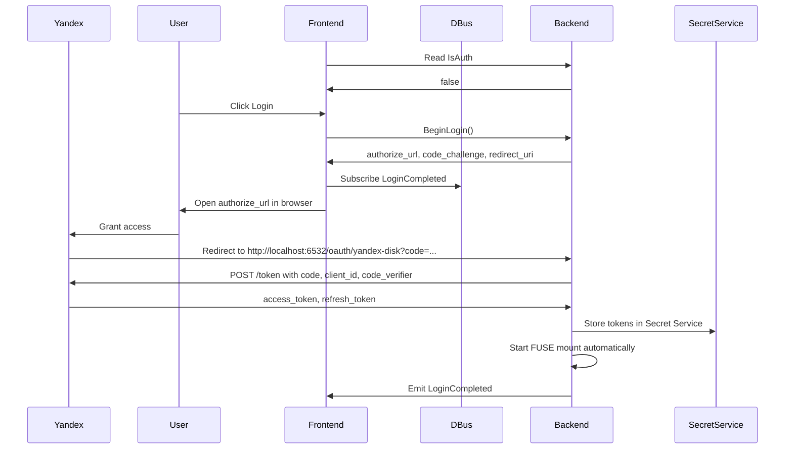

# discohack-daemon

Read-only FUSE mount for Yandex Disk.

## Requirements

- Linux with FUSE support (`/dev/fuse`)
- A running session D-Bus
- A Secret Service provider in the user session (for example GNOME Keyring or KWallet)
- Rust toolchain

## Configuration

The daemon no longer requires `YANDEX_DISK_TOKEN` in `.env` as the primary auth path.

Authentication is handled at runtime through:
- D-Bus service `ru.literallycats.daemon`
- Yandex OAuth PKCE flow
- localhost callback `http://localhost:6532/oauth/yandex-disk`
- Secret Service storage via the `secret-service` crate

The Yandex OAuth client is configured with redirect URI:

```text
http://localhost:6532/oauth/yandex-disk
```

## Run

```bash
cargo run -- <mountpoint>
```

Example:

```bash
mkdir -p /tmp/yadisk-mnt
cargo run -- /tmp/yadisk-mnt
```

Startup behavior:
- the daemon registers the session-bus name `ru.literallycats.daemon`
- it starts the OAuth callback listener on `http://localhost:6532/oauth/yandex-disk`
- if stored credentials already exist in Secret Service, it can mount immediately
- otherwise it stays alive with `IsAuth = false` until login completes

After successful login the daemon mounts Yandex Disk automatically. Then inspect the mounted filesystem:

```bash
ls -la /tmp/yadisk-mnt
cat /tmp/yadisk-mnt/some-file.txt
```

Stop the daemon with `Ctrl-C` or `SIGTERM` for a graceful shutdown. The daemon now attempts to unmount the FUSE mount before exiting so the same mountpoint can be reused immediately.

If graceful cleanup fails unexpectedly, recover the mountpoint manually:

```bash
fusermount -u /tmp/yadisk-mnt
```

## Logging

The daemon uses `tracing` for structured lifecycle logs.

- Default log level: `info`
- Override with `RUST_LOG`, for example:

```bash
RUST_LOG=debug cargo run -- /tmp/yadisk-mnt
```

## Current behavior

- Exposes `disk:/` as the mount root
- Supports directory traversal via `lookup`, `getattr`, and `readdir`
- Supports read-only file opens and reads
- Uses short-lived metadata caching to reduce repeated API calls
- Resolves file download URLs through the Yandex Disk API and reads file bytes over HTTP

## Limitations

This first version is intentionally read-only.

Unsupported operations are rejected with read-only filesystem errors, including:

- create
- write
- rename
- unlink
- mkdir
- rmdir
- setattr / truncate

Large files depend on HTTP performance and remote byte-range support. If the direct download endpoint ignores byte ranges, the daemon falls back to downloading the response body and slicing the requested window.

# Authentication

The daemon exposes a D-Bus API on:
- service: `ru.literallycats.daemon`
- object path: `/ru/literallycats/daemon`
- interface: `ru.literallycats.daemon`

Current interface:
- property `IsAuth`
- method `BeginLogin()`
- signal `LoginCompleted`

`BeginLogin()` returns:
- `authorize_url`
- `code_challenge`
- `redirect_uri`

PKCE details:
- the daemon generates a random `code_verifier`
- it computes `code_challenge = BASE64URL_NO_PAD(SHA256(code_verifier))`
- Yandex receives the `code_challenge` during `/authorize`
- the daemon sends the original `code_verifier` to `/token`

High-level flow:



Operational notes:
- the daemon uses Secret Service as the persistent token store
- access tokens are refreshed with the stored refresh token when needed
- the mounted filesystem continues using service-managed credentials instead of `.env`
