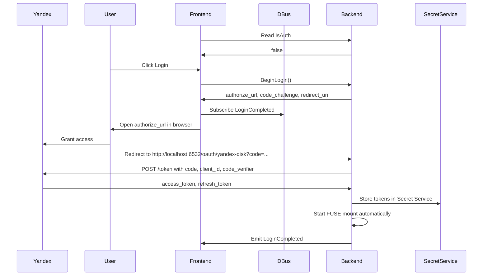

# discohack-daemon

FUSE mount for Yandex Disk with read and write support.

## Requirements

- Linux with FUSE support (`/dev/fuse`)
- A running session D-Bus
- A Secret Service provider in the user session (for example GNOME Keyring or KWallet)
- Rust toolchain

## Configuration

The daemon no longer requires `YANDEX_DISK_TOKEN` in `.env` as the primary auth path.

Authentication is handled at runtime through:
- D-Bus service `ru.literallycats.daemon`
- Yandex OAuth PKCE flow
- localhost callback `http://localhost:6532/oauth/yandex-disk`
- Secret Service storage via the `secret-service` crate

The Yandex OAuth client is configured with redirect URI:

```text
http://localhost:6532/oauth/yandex-disk
```

## Run

```bash
cargo run -- <mountpoint>
```

Example:

```bash
mkdir -p /tmp/yadisk-mnt
cargo run -- /tmp/yadisk-mnt
```

Startup behavior:
- the daemon registers the session-bus name `ru.literallycats.daemon`
- it starts the OAuth callback listener on `http://localhost:6532/oauth/yandex-disk`
- if stored credentials already exist in Secret Service, it can mount immediately
- otherwise it stays alive with `IsAuth = false` until login completes

After successful login the daemon mounts Yandex Disk automatically. Then inspect and modify the mounted filesystem:

```bash
ls -la /tmp/yadisk-mnt
cat /tmp/yadisk-mnt/some-file.txt
echo hello > /tmp/yadisk-mnt/hello.txt
mkdir -p /tmp/yadisk-mnt/new-dir
mv /tmp/yadisk-mnt/hello.txt /tmp/yadisk-mnt/new-dir/hello.txt
```

Stop the daemon with `Ctrl-C` or `SIGTERM` for a graceful shutdown. The daemon now attempts to unmount the FUSE mount before exiting so the same mountpoint can be reused immediately.

If graceful cleanup fails unexpectedly, recover the mountpoint manually:

```bash
fusermount -u /tmp/yadisk-mnt
```

## Logging

The daemon uses `tracing` for structured lifecycle logs.

- Default log level: `info`
- Override with `RUST_LOG`, for example:

```bash
RUST_LOG=debug cargo run -- /tmp/yadisk-mnt
```

## Current behavior

- Exposes `disk:/` as the mount root
- Supports local-first directory traversal, file reads, writes, truncation, `mkdir`, `unlink`, `rmdir`, and `rename`
- Uses SQLite as persistent metadata and queue storage
- Uses local cached files under the daemon state directory as the client-visible source of truth
- Queues remote mutations and refresh work for background sync instead of doing network work directly in write callbacks
- Recovers pending sync work after daemon restart
- Detects remote/local version conflicts and preserves both copies with numeric suffixes such as `file (2).txt`

## Offline-First Semantics

Writes are now local-first:

- opening an existing file for write stages the current local cached bytes in a temp file
- `write` and `truncate` modify that staged file locally
- `flush`, `fsync`, and final `release` commit the staged bytes into the local cache and enqueue a persistent sync job
- background workers later upload, delete, rename, mkdir, refresh metadata, and hydrate missing file bytes
- if the network is unavailable, local reads and writes continue against local state and queued work is retried later

Reads are also local-first:

- directory listings and attributes come from persistent metadata
- file bytes come from the local cache when present
- placeholder files are downloaded lazily on first read

## State Root

The daemon keeps sync state under:

```text
${XDG_STATE_HOME:-$HOME/.local/state}/discohack-daemon/
```

Important contents:

- `metadata.db`: SQLite metadata, queue, leases, and conflicts
- `cache/`: local hydrated file contents

## D-Bus API

The daemon exposes a D-Bus API on:

- service: `ru.literallycats.daemon`
- object path: `/ru/literallycats/daemon`
- interface: `ru.literallycats.daemon`

Auth properties and methods:

- property `IsAuth`
- method `BeginLogin()`
- signal `LoginCompleted`

Sync properties and methods:

- property `MountPoint: s`
- property `SyncSummary: a{sv}`
- property `SyncItems: aa{sv}`
- method `GetSyncStatus(path: s) -> a{sv}`
- method `ListDirectoryStatuses(path: s) -> aa{sv}`
- method `RequestRefresh(path: s)`

Global sync updates are emitted via standard `org.freedesktop.DBus.Properties.PropertiesChanged`.

## Limitations

- Writes are still whole-file uploads, not remote block patches
- Periodic tree refresh is a safe baseline; provider-native delta sync is not implemented yet
- Lazy hydration currently downloads missing file bytes during the requesting filesystem operation
- `mknod` and other advanced filesystem operations are still not implemented

More detail is in `docs/offline-first-sync.md`.

# Authentication

The auth flow continues to use the same D-Bus service and PKCE flow. The D-Bus interface now also includes sync state properties and path status methods described above.

`BeginLogin()` returns:
- `authorize_url`
- `code_challenge`
- `redirect_uri`

PKCE details:
- the daemon generates a random `code_verifier`
- it computes `code_challenge = BASE64URL_NO_PAD(SHA256(code_verifier))`
- Yandex receives the `code_challenge` during `/authorize`
- the daemon sends the original `code_verifier` to `/token`

High-level flow:



Operational notes:
- the daemon uses Secret Service as the persistent token store
- access tokens are refreshed with the stored refresh token when needed
- the mounted filesystem continues using service-managed credentials instead of `.env`
