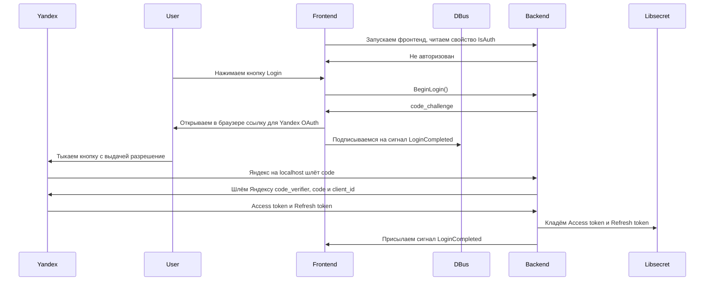

# discohack-daemon

Read-only FUSE mount for Yandex Disk.

## Requirements

- Linux with FUSE support (`/dev/fuse`)
- A Yandex Disk OAuth token
- Rust toolchain

## Configuration

Create a `.env` file or export the token in your shell:

```env
YANDEX_DISK_TOKEN=your_oauth_token_here
```

The daemon also accepts `TOKEN` and `YANDEX_TOKEN`, but `YANDEX_DISK_TOKEN` is the preferred name.

## Run

```bash
cargo run -- <mountpoint>
```

Example:

```bash
mkdir -p /tmp/yadisk-mnt
cargo run -- /tmp/yadisk-mnt
```

Then inspect the mounted filesystem:

```bash
ls -la /tmp/yadisk-mnt
cat /tmp/yadisk-mnt/some-file.txt
```

Stop the daemon with `Ctrl-C` or `SIGTERM` for a graceful shutdown. The daemon now attempts to unmount the FUSE mount before exiting so the same mountpoint can be reused immediately.

If graceful cleanup fails unexpectedly, recover the mountpoint manually:

```bash
fusermount -u /tmp/yadisk-mnt
```

## Logging

The daemon uses `tracing` for structured lifecycle logs.

- Default log level: `info`
- Override with `RUST_LOG`, for example:

```bash
RUST_LOG=debug cargo run -- /tmp/yadisk-mnt
```

## Current behavior

- Exposes `disk:/` as the mount root
- Supports directory traversal via `lookup`, `getattr`, and `readdir`
- Supports read-only file opens and reads
- Uses short-lived metadata caching to reduce repeated API calls
- Resolves file download URLs through the Yandex Disk API and reads file bytes over HTTP

## Limitations

This first version is intentionally read-only.

Unsupported operations are rejected with read-only filesystem errors, including:

- create
- write
- rename
- unlink
- mkdir
- rmdir
- setattr / truncate

Large files depend on HTTP performance and remote byte-range support. If the direct download endpoint ignores byte ranges, the daemon falls back to downloading the response body and slicing the requested window.

# Authentication


